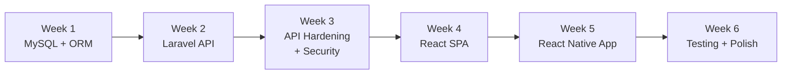

# 6-Week Café Plan — Overview & Codebase Mapping

This document reproduces the **high-level overview** from [`6_week_cafe_plan_v1.md.resolved`](6_week_cafe_plan_v1.md.resolved) and maps each theme to **where it is implemented** in this repository (or notes a gap). Paths are relative to the repo root.

**Stack (plan):** Laravel REST API · MySQL · React (SPA) · React Native Expo  

**Actual layout:** Laravel lives under [`API/api_cafe_v/`](API/api_cafe_v/), the browser client under [`WEB/web_cafe_v/`](WEB/web_cafe_v/), and the Expo app under [`APP/app_cafe_v/`](APP/app_cafe_v/).

---

## Overview (from learning plan)

> **Note:** In [`6_week_cafe_plan_v1.md.resolved`](6_week_cafe_plan_v1.md.resolved), section headings use **Week 4** for Security and **Week 3** for React SPA (order swapped vs the diagram). The mapping below follows **those section titles**.

---

## Week 1 — Database Design & ORM

| Plan item | In codebase | Notes |
|-----------|----------------|-------|
| MySQL migrations | [`API/api_cafe_v/database/migrations/`](API/api_cafe_v/database/migrations/) | Includes `users`, `categories`, `menu`, `reservations`, café `table` graph, reservation holds, jobs/cache (framework). |

| Eloquent models | [`API/api_cafe_v/app/Models/User.php`](API/api_cafe_v/app/Models/User.php), [`Category.php`](API/api_cafe_v/app/Models/Category.php), [`MenuItem.php`](API/api_cafe_v/app/Models/MenuItem.php), [`Table.php`](API/api_cafe_v/app/Models/Table.php), [`Reservation.php`](API/api_cafe_v/app/Models/Reservation.php) | Five first-class models; pivot-style tables exist in migrations without dedicated models where not needed. |

| Seeders + Faker | [`API/api_cafe_v/database/seeders/`](API/api_cafe_v/database/seeders/), [`API/api_cafe_v/database/factories/`](API/api_cafe_v/database/factories/) | `DatabaseSeeder`, category/menu/table/reservation seeders; `MenuItemFactory`, `MenuFactory`, etc. |
| ≥ 20 entities in domain | — | **Gap:** schema is café-focused but not expanded to the full 20+ entity list from the plan (no `Order`, `Supplier`, `Invoice`, …). |

| MongoDB + performance comparison | — | **Gap:** no app-level MongoDB integration or benchmark doc in-repo |

---

## Week 2 — Laravel REST API (Core)

| Plan item | In codebase | Notes |
|-----------|----------------|-------|
| API routes | [`API/api_cafe_v/routes/api.php`](API/api_cafe_v/routes/api.php) | `reservation`, `category`, auth, reservation holds, table availability , manual selection. |

| REST controllers | [`API/api_cafe_v/app/Http/Controllers/Api/CategoryController.php`](API/api_cafe_v/app/Http/Controllers/Api/CategoryController.php), [`ReservationController.php`](API/api_cafe_v/app/Http/Controllers/Api/ReservationController.php), [`AuthController.php`](API/api_cafe_v/app/Http/Controllers/Api/AuthController.php), [`MenuController.php`](API/api_cafe_v/app/Http/Controllers/Api/MenuController.php), [`TableController.php`](API/api_cafe_v/app/Http/Controllers/Api/TableController.php) | Menu logic exists; **no `Route::apiResource` (or similar) for menu** is registered in `api.php` yet—SPA loads menu via [`/category`](WEB/web_cafe_v/src/service/routes.js) with nested items. |

| API resources (transformers) | [`API/api_cafe_v/app/Http/Resources/`](API/api_cafe_v/app/Http/Resources/) | e.g. `CategoryResource`, `MenuResource`, `ReservationResource`. |

| Sanctum token auth | [`API/api_cafe_v/routes/api.php`](API/api_cafe_v/routes/api.php) (`/login`, `/logout`, `auth:sanctum` routes), [`AuthController.php`](API/api_cafe_v/app/Http/Controllers/Api/AuthController.php), [`User` model tokens](API/api_cafe_v/app/Models/User.php) | Token-based API login/logout pattern. |

| Repository pattern + DI | — | **Gap:** no `app/Repositories` layer or explicit repository bindings (controllers talk to Eloquent directly). |

| Background jobs (e.g. email) | [`API/api_cafe_v/database/migrations/0001_01_01_000002_create_jobs_table.php`](API/api_cafe_v/database/migrations/0001_01_01_000002_create_jobs_table.php) | Jobs **table** exists; **no domain `app/Jobs`** for café workflows in-repo. |

| Full CRUD for Products / Orders / Reservations / Users | Partial | **Categories + reservations:** CRUD-style API resources. **Orders / full user CRUD / standalone products API:** not present as in the plan table. |

---

## Week 4 — Security & API Hardening *(section title in source doc)*

| Plan item | In codebase | Notes |
|-----------|----------------|-------|
| Password hashing (bcrypt) | Laravel defaults + Fortify flows | Web stack uses Fortify; see [`API/api_cafe_v/config/fortify.php`](API/api_cafe_v/config/fortify.php), actions under [`API/api_cafe_v/app/Actions/Fortify/`](API/api_cafe_v/app/Actions/Fortify/). |

| Input validation | Form requests / controller validation | e.g. [`CategoryRequest.php`](API/api_cafe_v/app/Http/Requests/CategoryRequest.php), validation in [`AuthController.php`](API/api_cafe_v/app/Http/Controllers/Api/AuthController.php). |

| Rate limiting | It is defined in AppServiceProvider.pphp  |  [`API/api_cafe_v/routes/api.php`](API/api_cafe_v/routes/api.php) | `throttle:availability` on table endpoints. |

| CORS for browser / Expo web | [`API/api_cafe_v/config/cors.php`](API/api_cafe_v/config/cors.php) | Documents localhost ports for CRA, Vite-style, Metro/Expo. |

| API middleware stack | [`API/api_cafe_v/bootstrap/app.php`](API/api_cafe_v/bootstrap/app.php) | `HandleCors` on `api`. |
| XSS headers / RBAC Gates-Policies / OWASP docs / ZAP | — | **Gap:** no dedicated security middleware doc, policies, or committed ZAP report in this repo. [`AppServiceProvider.php`](API/api_cafe_v/app/Providers/AppServiceProvider.php) contains commented Gate examples only. |

---

## Week 3 — React SPA *(section title in source doc)*

| Plan item | In codebase | Notes |
|-----------|----------------|-------|
| React SPA + Router | [`WEB/web_cafe_v/src/App.jsx`](WEB/web_cafe_v/src/App.jsx) | `react-router-dom` routes for menu + reservation. |
| Menu page | [`WEB/web_cafe_v/src/pages/Menu.jsx`](WEB/web_cafe_v/src/pages/Menu.jsx) | Consumes categories (with menu items) from API. |
| Reservation flow | [`WEB/web_cafe_v/src/pages/Reservation.jsx`](WEB/web_cafe_v/src/pages/Reservation.jsx), [`WEB/web_cafe_v/src/components/ReservationComponent.jsx`](WEB/web_cafe_v/src/components/ReservationComponent.jsx) | Multi-step UI. |
| API client + token header | [`WEB/web_cafe_v/src/service/api.js`](WEB/web_cafe_v/src/service/api.js), [`WEB/web_cafe_v/src/service/routes.js`](WEB/web_cafe_v/src/service/routes.js) | `fetch` wrapper + `Authorization: Bearer` from `localStorage`. |
| Vite + TypeScript *(plan)* | — | **Different stack:** Create React App ([`WEB/web_cafe_v/package.json`](WEB/web_cafe_v/package.json)), JavaScript. |
| Admin dashboard / Zustand / Axios | — | **Gap:** no admin CRUD UI; no Zustand; uses `fetch` instead of Axios. |

---

## Week 5 — React Native Expo App

| Plan item | In codebase | Notes |
|-----------|----------------|-------|
| Expo Router app | [`APP/app_cafe_v/app/`](APP/app_cafe_v/app/) | `_layout.tsx`, tabs, `login.tsx`, reservation tab, etc. |
| API client | [`APP/app_cafe_v/src/api/api.ts`](APP/app_cafe_v/src/api/api.ts), [`APP/app_cafe_v/src/api/routes.ts`](APP/app_cafe_v/src/api/routes.ts), [`APP/app_cafe_v/src/service/apiFetch.ts`](APP/app_cafe_v/src/service/apiFetch.ts) | Fetch helpers aligned with Laravel API. |

| Auth + token persistence | [`APP/app_cafe_v/src/auth/AuthProvider.tsx`](APP/app_cafe_v/src/auth/AuthProvider.tsx), [`APP/app_cafe_v/src/service/tokenStorage.ts`](APP/app_cafe_v/src/service/tokenStorage.ts) | AsyncStorage (with web fallback); **plan asked for SecureStore**—not wired via `expo-secure-store` in [`APP/app_cafe_v/package.json`](APP/app_cafe_v/package.json). |

| Reservation UI | [`APP/app_cafe_v/app/features/reservation.tsx`](APP/app_cafe_v/app/features/reservation.tsx), [`APP/app_cafe_v/app/(tabs)/reservation.tsx`](APP/app_cafe_v/app/(tabs)/reservation.tsx) | Feature + tab screen. |

---

## Week 6 — Testing, Performance & Polish

| Plan item | In codebase | Notes |
|-----------|----------------|-------|
| PHPUnit / Laravel feature tests | [`API/api_cafe_v/tests/`](API/api_cafe_v/tests/) | Auth, settings, dashboard, [`ManualTableSelectionTest.php`](API/api_cafe_v/tests/Feature/ManualTableSelectionTest.php), etc. |

| React Testing Library | [`WEB/web_cafe_v/src/App.test.js`](WEB/web_cafe_v/src/App.test.js), [`WEB/web_cafe_v/src/setupTests.js`](WEB/web_cafe_v/src/setupTests.js) | CRA test harness. |

| Cypress / Playwright / k6 / JMeter | — | **Gap:** not present in repo. |
| Load-test / final OWASP reports | — | **Gap:** no committed reports. |

---

## Mono-repo vs plan diagram

The plan suggests `backend/`, `frontend/`, `mobile/`. This repo uses:

| Plan folder | This repo |
|-------------|-----------|
| `backend/` | [`API/api_cafe_v/`](API/api_cafe_v/) |
| `frontend/` | [`WEB/web_cafe_v/`](WEB/web_cafe_v/) |
| `mobile/` | [`APP/app_cafe_v/`](APP/app_cafe_v/) |

---

## Quick “happy path” trace

1. **Browse menu (web):** [`Menu.jsx`](WEB/web_cafe_v/src/pages/Menu.jsx) → [`routes.js` `getMenuByCategory`](WEB/web_cafe_v/src/service/routes.js) → `GET /api/category` → [`CategoryController`](API/api_cafe_v/app/Http/Controllers/Api/CategoryController.php).
2. **Reserve (web):** [`Reservation.jsx`](WEB/web_cafe_v/src/pages/Reservation.jsx) → holds / availability / `POST /api/reservation` in [`routes.js`](WEB/web_cafe_v/src/service/routes.js) → [`ReservationController`](API/api_cafe_v/app/Http/Controllers/Api/ReservationController.php) / [`TableController`](API/api_cafe_v/app/Http/Controllers/TableController.php).
3. **Login (mobile):** [`login.tsx`](APP/app_cafe_v/app/login.tsx) + [`AuthProvider.tsx`](APP/app_cafe_v/src/auth/AuthProvider.tsx) → `POST /api/login` in [`APP/app_cafe_v/src/api/routes.ts`](APP/app_cafe_v/src/api/routes.ts).

---

*Generated as a companion to [`6_week_cafe_plan_v1.md.resolved`](6_week_cafe_plan_v1.md.resolved). Update this file when new milestones land in the codebase.*
