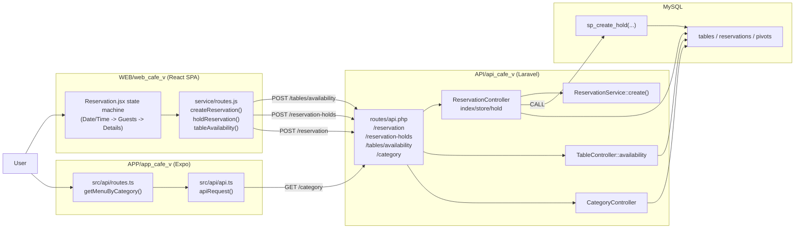

# Cafe V Codebase Architecture Diagram

```mermaid
flowchart LR
    U[User]

    subgraph WEB["WEB/web_cafe_v (React SPA)"]
      W1["Reservation.jsx state machine\n(Date/Time -> Guests -> Details)"]
      W2["service/routes.js\ncreateReservation()\nholdReservation()\ntableAvailability()"]
    end

    subgraph APP["APP/app_cafe_v (Expo)"]
      A1["src/api/routes.ts\ngetMenuByCategory()"]
      A2["src/api/api.ts\napiRequest()"]
    end

    subgraph API["API/api_cafe_v (Laravel)"]
      R["routes/api.php\n/reservation\n/reservation-holds\n/tables/availability\n/category"]
      RC["ReservationController\nindex/store/hold"]
      RS["ReservationService::create()"]
      TC["TableController::availability"]
      CC["CategoryController"]
    end

    subgraph DB["MySQL"]
      SP1["sp_create_hold(...)"]
      TBL["tables / reservations / pivots"]
    end

    U --> W1
    W1 --> W2
    W2 -->|POST /tables/availability| R
    W2 -->|POST /reservation-holds| R
    W2 -->|POST /reservation| R

    U --> A1
    A1 --> A2
    A2 -->|GET /category| R

    R --> RC
    R --> TC
    R --> CC
    RC --> RS
    RC -->|CALL| SP1
    RC --> TBL
    TC --> TBL
    CC --> TBL
    SP1 --> TBL
```
