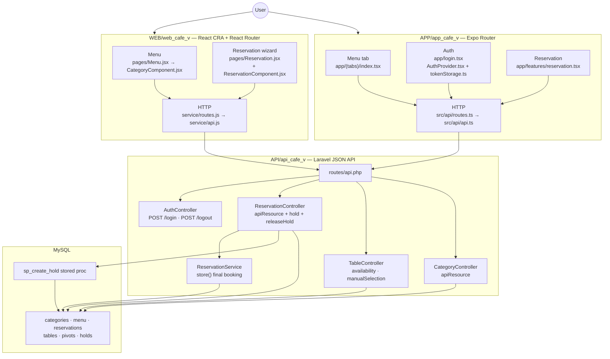

# Cafe V Codebase Architecture Diagram

High-level data flow for the **three-app** layout: React web client ([`WEB/web_cafe_v/`](WEB/web_cafe_v/)), Expo mobile client ([`APP/app_cafe_v/`](APP/app_cafe_v/)), and Laravel backend ([`API/api_cafe_v/`](API/api_cafe_v/))). All JSON traffic goes to **`/api/*`** on the Laravel host (see [`WEB/web_cafe_v/src/service/api.js`](WEB/web_cafe_v/src/service/api.js) and [`APP/app_cafe_v/src/api/api.ts`](APP/app_cafe_v/src/api/api.ts)).

---

## Request flow (clients → API → persistence)

### How the pieces connect

| Client | Main entry files | Typical API calls |
|--------|------------------|-------------------|
| Web | [`WEB/web_cafe_v/src/pages/Menu.jsx`](WEB/web_cafe_v/src/pages/Menu.jsx), [`CategoryComponent.jsx`](WEB/web_cafe_v/src/components/CategoryComponent.jsx), [`Reservation.jsx`](WEB/web_cafe_v/src/pages/Reservation.jsx), [`service/routes.js`](WEB/web_cafe_v/src/service/routes.js) | `GET /category` (menu by category); reservation flow uses `POST /tables/availability`, `POST /reservation-holds`, `DELETE /reservation-holds/{id}`, `POST /reservation` (public booking; no Bearer token in [`api.js`](WEB/web_cafe_v/src/service/api.js)) |
| Expo | [`APP/app_cafe_v/app/(tabs)/index.tsx`](APP/app_cafe_v/app/(tabs)/index.tsx), [`app/login.tsx`](APP/app_cafe_v/app/login.tsx), [`app/features/reservation.tsx`](APP/app_cafe_v/app/features/reservation.tsx), [`src/api/routes.ts`](APP/app_cafe_v/src/api/routes.ts) | `GET /category`; `POST /login` / `POST /logout` (Bearer on logout); authenticated table pick uses `POST /tables/manual-selection`; `POST /reservation` to commit |

Backend routing and middleware: [`API/api_cafe_v/routes/api.php`](API/api_cafe_v/routes/api.php). CORS for browser and Expo dev is configured in [`API/api_cafe_v/config/cors.php`](API/api_cafe_v/config/cors.php) and attached in [`API/api_cafe_v/bootstrap/app.php`](API/api_cafe_v/bootstrap/app.php).

---

## Backend responsibilities (same repo)

| Area | Role | Key code |
|------|------|-----------|
| Holds (web-style wizard) | Temporary lock + pivot rows via DB procedure | [`ReservationController::hold`](API/api_cafe_v/app/Http/Controllers/Api/ReservationController.php) → `CALL sp_create_hold` → `reservation_holds` / `reservation_hold_tables` |
| Final reservation | Validate overlap + `Reservation` + `syncWithoutDetaching` | [`ReservationController::store`](API/api_cafe_v/app/Http/Controllers/Api/ReservationController.php) → [`ReservationService::create`](API/api_cafe_v/app/Services/ReservationService.php) |
| Table availability | Suggest tables for a time window (throttled) | [`TableController::availability`](API/api_cafe_v/app/Http/Controllers/TableController.php) |
| Staff / manual pick | Sanctum + throttled POST | [`TableController::manualSelection`](API/api_cafe_v/app/Http/Controllers/TableController.php) (`auth:sanctum`) |
| Menu JSON | Categories with nested menu items (Eloquent + API resources) | [`CategoryController`](API/api_cafe_v/app/Http/Controllers/Api/CategoryController.php), [`CategoryResource`](API/api_cafe_v/app/Http/Resources/CategoryResource.php) / [`MenuResource`](API/api_cafe_v/app/Http/Resources/MenuResource.php) |
| Auth tokens | Sanctum personal access tokens | [`AuthController`](API/api_cafe_v/app/Http/Controllers/Api/AuthController.php), [`User`](API/api_cafe_v/app/Models/User.php) `HasApiTokens` |

[`App\Http\Controllers\Api\MenuController`](API/api_cafe_v/app/Http/Controllers/Api/MenuController.php) exists but **is not registered** in `routes/api.php`; menu exposure is through **`/api/category`** today.

---

## Same Laravel app, different surface (not on diagram)

The backend also ships **Inertia + Fortify** for server-rendered pages (e.g. welcome / dashboard) via [`API/api_cafe_v/routes/web.php`](API/api_cafe_v/routes/web.php) and [`resources/js/`](API/api_cafe_v/resources/js/). The café **SPA and Expo clients** do not use those routes for menu or reservations; they only depend on **`/api/*`**.

---

## Persistence

Schema detail: [`entity_relationship_diagram.md`](entity_relationship_diagram.md). Migrations: [`API/api_cafe_v/database/migrations/`](API/api_cafe_v/database/migrations/).
