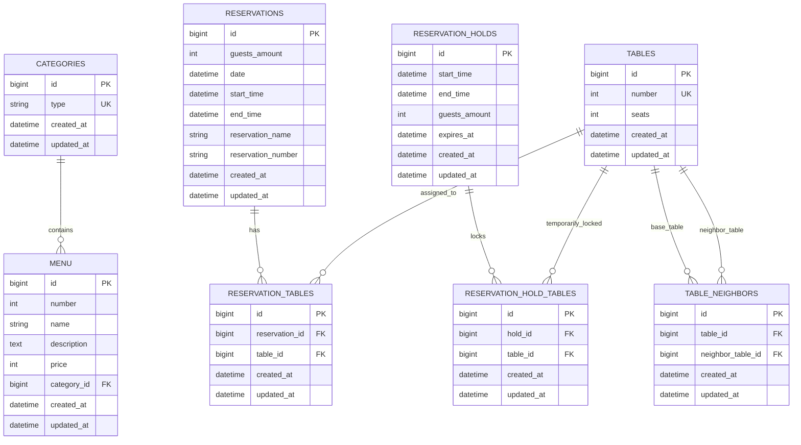

# Cafe V Entity Relationship Diagram (ERD)

## Notes

- `reservation_tables` is the many-to-many bridge between `reservations` and `tables`.
- `reservation_hold_tables` is the temporary hold bridge used before final reservation creation.
- `table_neighbors` is a self-referencing relation on `tables` for adjacency/combination logic.
- `sp_create_hold` (stored procedure) populates `reservation_holds` and `reservation_hold_tables` as part of the temporary table-lock/hold flow.
