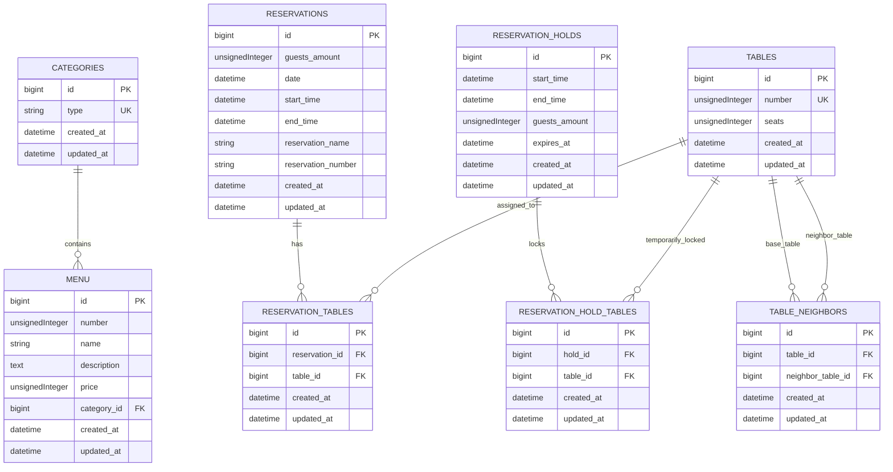
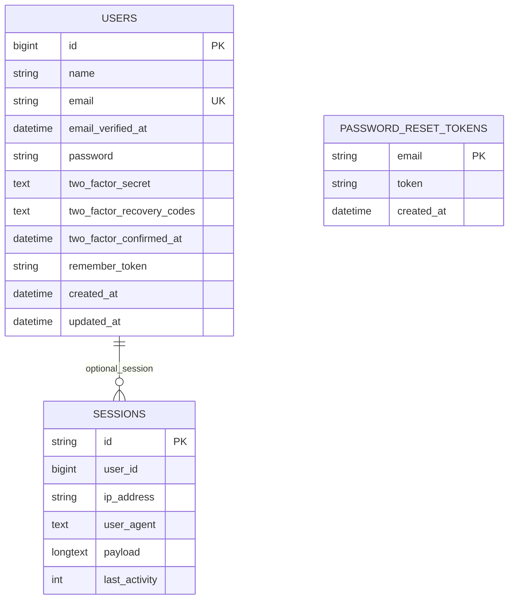

# Cafe V Entity Relationship Diagram (ERD)

This ERD reflects the **MySQL schema** defined by Laravel migrations in [`API/api_cafe_v/database/migrations/`](API/api_cafe_v/database/migrations/). Eloquent models live in [`API/api_cafe_v/app/Models/`](API/api_cafe_v/app/Models/).

## Domain schema (café)

```mermaid
erDiagram
    CATEGORIES ||--o{ MENU : contains

    RESERVATIONS ||--o{ RESERVATION_TABLES : has
    TABLES ||--o{ RESERVATION_TABLES : assigned_to

    RESERVATION_HOLDS ||--o{ RESERVATION_HOLD_TABLES : locks
    TABLES ||--o{ RESERVATION_HOLD_TABLES : temporarily_locked

    TABLES ||--o{ TABLE_NEIGHBORS : base_table
    TABLES ||--o{ TABLE_NEIGHBORS : neighbor_table

    CATEGORIES {
      bigint id PK
      string type UK
      datetime created_at
      datetime updated_at
    }

    MENU {
      bigint id PK
      unsignedInteger number
      string name
      text description
      unsignedInteger price
      bigint category_id FK
      datetime created_at
      datetime updated_at
    }

    RESERVATIONS {
      bigint id PK
      unsignedInteger guests_amount
      datetime date
      datetime start_time
      datetime end_time
      string reservation_name
      string reservation_number
      datetime created_at
      datetime updated_at
    }

    TABLES {
      bigint id PK
      unsignedInteger number UK
      unsignedInteger seats
      datetime created_at
      datetime updated_at
    }

    RESERVATION_TABLES {
      bigint id PK
      bigint reservation_id FK
      bigint table_id FK
      datetime created_at
      datetime updated_at
    }

    RESERVATION_HOLDS {
      bigint id PK
      datetime start_time
      datetime end_time
      unsignedInteger guests_amount
      datetime expires_at
      datetime created_at
      datetime updated_at
    }

    RESERVATION_HOLD_TABLES {
      bigint id PK
      bigint hold_id FK
      bigint table_id FK
      datetime created_at
      datetime updated_at
    }

    TABLE_NEIGHBORS {
      bigint id PK
      bigint table_id FK
      bigint neighbor_table_id FK
      datetime created_at
      datetime updated_at
    }
```

### Constraints and indexes (from migrations)

| Table | Constraint / index |
|-------|---------------------|
| `categories` | `type` **unique** |
| `menu` | `category_id` → `categories.id`, **on delete cascade** |
| `tables` | `number` **unique** |
| `reservation_tables` | **unique** `(reservation_id, table_id)`; index `(table_id, reservation_id)`; FKs cascade on delete |
| `table_neighbors` | **unique** `(table_id, neighbor_table_id)`; index `(neighbor_table_id, table_id)`; FKs cascade on delete |
| `reservation_hold_tables` | **unique** `(hold_id, table_id)`; index `(table_id, hold_id)`; FKs cascade on delete |
| `reservation_holds` | index on `expires_at`; composite index `(start_time, end_time)` |

---

## Auth and session (Laravel defaults)

`users`, `password_reset_tokens`, and `sessions` are created in [`0001_01_01_000000_create_users_table.php`](API/api_cafe_v/database/migrations/0001_01_01_000000_create_users_table.php). Two-factor columns are added in [`2025_08_14_170933_add_two_factor_columns_to_users_table.php`](API/api_cafe_v/database/migrations/2025_08_14_170933_add_two_factor_columns_to_users_table.php).

```mermaid
erDiagram
    USERS {
      bigint id PK
      string name
      string email UK
      datetime email_verified_at
      string password
      text two_factor_secret
      text two_factor_recovery_codes
      datetime two_factor_confirmed_at
      string remember_token
      datetime created_at
      datetime updated_at
    }

    PASSWORD_RESET_TOKENS {
      string email PK
      string token
      datetime created_at
    }

    SESSIONS {
      string id PK
      bigint user_id
      string ip_address
      text user_agent
      longtext payload
      int last_activity
    }

    USERS ||--o{ SESSIONS : optional_session
```

There is **no foreign key** in migrations from `reservations` (or other café tables) to `users`. Guest identity is stored on the reservation as `reservation_name` / `reservation_number` only.

Column nullability (migration-level): `menu.description` is nullable; on `users`, `email_verified_at`, two-factor fields, and `remember_token` are nullable; `sessions.user_id` is nullable and indexed (Laravel does not add a named `FOREIGN KEY` to `users` in the default `sessions` migration—only the column + index).

**Sanctum:** [`User`](API/api_cafe_v/app/Models/User.php) uses `HasApiTokens`. There is **no** `personal_access_tokens` migration checked into this repo’s `database/migrations`; if you run `php artisan vendor:publish --provider="Laravel\Sanctum\SanctumServiceProvider"`, expect that table with a polymorphic link to `users`.

---

## Laravel framework tables (non-domain)

Present in the same migration set; not part of the café domain model but part of the deployed schema:

- [`0001_01_01_000001_create_cache_table.php`](API/api_cafe_v/database/migrations/0001_01_01_000001_create_cache_table.php): `cache`, `cache_locks`
- [`0001_01_01_000002_create_jobs_table.php`](API/api_cafe_v/database/migrations/0001_01_01_000002_create_jobs_table.php): `jobs`, `job_batches`, `failed_jobs`

---

## Notes

- Physical table name for menu rows is **`menu`**; the Eloquent model is [`MenuItem`](API/api_cafe_v/app/Models/MenuItem.php) with `$table = 'menu'`.
- `reservation_tables` is the many-to-many bridge between `reservations` and `tables`.
- `reservation_hold_tables` is the temporary hold bridge before a reservation is committed; it references `reservation_holds.id` via column **`hold_id`**.
- `table_neighbors` is a self-referencing many-to-many on `tables` (which tables can be combined / are adjacent).
- [`ReservationController`](API/api_cafe_v/app/Http/Controllers/Api/ReservationController.php) calls **`sp_create_hold`** to populate `reservation_holds` and `reservation_hold_tables` as part of the hold flow; the procedure itself is **database-side** (not in the Laravel migrations folder).
