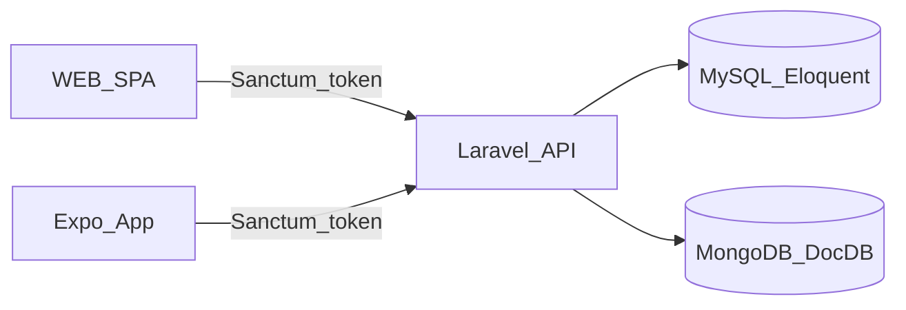

## Goals (your reduced scope)
- **Backend (Laravel)**: stable API for **Menu (Read)** + **Reservations (Full CRUD)** + **Auth (Sanctum token)**.
- **Web (SPA)**: finish `WEB/web_cafe_v` with **login + reservations CRUD UI** + menu read UI (already mostly there).
- **Mobile (Expo)**: finish `APP/app_cafe_v` with **login + reservations CRUD UI** + menu read UI (already mostly there).
- **DB/ORM + MongoDB**: document a ≥20-entity domain model (can be “designed” even if you only fully implement a subset) + show real ORM queries + a small MongoDB project + performance comparison.
- **Testing & security**: a test plan + automated tests + one load test + one security scan + brief writeups (hashing/SSL, SQLi/XSS, OWASP risks).

## Current status (from repo)
- **Menu read works via categories**: `GET /api/category` is used by both web and app.
  - API: `[...]/API/api_cafe_v/routes/api.php`, `[...]/app/Http/Controllers/Api/CategoryController.php`
  - WEB: `[...]/WEB/web_cafe_v/src/pages/Menu.jsx`
  - APP: `[...]/APP/app_cafe_v/app/(tabs)/index.tsx`
- **Reservations are scaffolded but not wired**: controller/migrations/models/seeders have gaps and there’s **no reservations route**.
  - Controller: `[...]/API/api_cafe_v/app/Http/Controllers/Api/ReservationController.php`
  - Routes: `[...]/API/api_cafe_v/routes/api.php`
- **Auth exists only for Laravel web UI (Fortify)**, not for API tokens.
  - Fortify: `[...]/API/api_cafe_v/config/fortify.php`
- **WEB SPA is the chosen UI**; mobile reservation tab is still template.

## Architecture target (simple and deliverable-focused)

## Week-by-week plan (4 weeks left)

### Week 3 (now) — Stabilize backend API + DB so clients can integrate
- **Fix DB layer to a working minimum**
  - Make `tables` + `reservations` schema consistent and migratable (your repo has a broken tables migration: `[...]/database/migrations/2026_04_17_075351_table.php`).
  - Ensure `Reservation` ↔ `Table` relations match columns (`table_id` vs hasMany/belongsTo issues in `[...]/app/Models/Reservation.php` and `[...]/app/Models/Table.php`).
  - Ensure seeders/factories run cleanly (`[...]/database/seeders/*`).
- **Reservations API (CRUD) + validation**
  - Add `Route::apiResource('reservations', ...)` to `[...]/routes/api.php`.
  - Implement controller methods in `[...]/app/Http/Controllers/Api/ReservationController.php` with:
    - request validation (FormRequests),
    - correct JSON resources (`[...]/app/Http/Resources/ReservationResource.php`),
    - proper error responses.
- **Auth for API consumers (Sanctum)**
  - Install/config Sanctum, create `POST /api/auth/login` + `POST /api/auth/logout`.
  - Protect reservation routes with `auth:sanctum` (Menu read stays public).
- **Menu read-only cleanup**
  - Ensure `GET /api/menu` is either implemented or remove/disable unused routes; keep the working `GET /api/category` path as “Menu read” to avoid rework.
- **Deliverables (end of week)**
  - Postman collection demonstrates: login → token → reservation CRUD → logout.
  - DB migrations + seeders run end-to-end (fresh migrate + seed).

  Best way to add a stored procedure for Reservations (and why)
Given your project stack (MySQL + Laravel/Eloquent) and your scope (Reservations = full CRUD), the best “school‑project strong” stored procedure is one that:

Implements one business-critical operation atomically (all checks + insert/update in one DB transaction)
Prevents race conditions (two users booking the same table/time)
Centralizes rules in the DB (so Web + App + any future client behave the same)
That usually means: a stored procedure that creates a reservation only if a table is available for the requested timeslot (and returns either the created reservation id or an error code/message).

This is better than a “simple INSERT procedure” because it demonstrates why procedures exist: consistency + concurrency safety + performance (fewer round trips, set-based checks).

What the procedure should do (recommended spec)
Procedure: sp_create_reservation(...)

Inputs (adapt to your columns):

p_table_id
p_start_at and p_end_at (or p_date + p_time + p_duration)
p_guest_count
p_customer_name / p_phone (if you store that)
(optional) p_user_id if you link reservations to users via login
Logic:

Validate basic rules (end > start, guest_count > 0, etc.)
Check table exists and capacity fits (if you store capacity)
Check overlap: no existing reservation overlaps the requested interval
If available: insert reservation
Return: reservation_id (and maybe a status code)
Why this is ideal

One unit of work: check + write are together (no “check in Laravel then insert” race).
DB is the source of truth for availability.
Easy to demo with Postman + MySQL Workbench.
MySQL specifics (important details)
1) Overlap rule (core of reservation booking)
If you store (start_at, end_at), the standard overlap test is:

Existing overlaps new if: existing.start_at < new.end_at AND existing.end_at > new.start_at
So your availability check should look like that.

2) Race conditions + locking
Even with the overlap query, two requests can slip in concurrently unless you lock properly. Practical options:

Use transactions + locking reads
InnoDB + START TRANSACTION
Lock the table row: SELECT ... FROM tables WHERE id = p_table_id FOR UPDATE;
Then run the overlap check and insert
Or use SERIALIZABLE isolation (heavier)
Or use unique constraints (often not enough for time range overlaps)
For your school scope, “transaction + FOR UPDATE” is a solid, explainable choice.

3) Indexing (performance)
Add an index to speed overlap checks, typically:

INDEX(table_id, start_at, end_at) (or at least INDEX(table_id, start_at))
You can mention this in your DB documentation.

4) How to return results from MySQL procedures
Common patterns:

SELECT reservation_id AS reservation_id; at the end (Laravel can read the first row)
Or use OUT parameters (Laravel can handle but it’s more awkward)
For Laravel simplicity, return via a final SELECT.

Laravel specifics (Eloquent + calling stored procedures)
1) Best practice: keep Eloquent for reads, procedure for the “critical write”
In Laravel, it’s totally normal to:

Use Eloquent for listing reservations (GET /api/reservations)
Use the stored procedure for create (POST /api/reservations), because it enforces “availability”
That demonstrates ORM competence and stored procedure competence.

2) How to call it
In Laravel you typically call procedures via the DB facade:

DB::select('CALL sp_create_reservation(?, ?, ?, ?, ?)', [...])
and read the returned row.
Or DB::statement(...) if you don’t need results.

Important: if your procedure does its own transaction (START TRANSACTION ... COMMIT), don’t also wrap it in a Laravel DB::transaction() unless you’re sure about nested transaction behavior (MySQL doesn’t do true nested transactions; Laravel uses savepoints in some cases). Easiest: let the procedure own the transaction.

3) Validation still belongs in Laravel too
You should still validate request shape with Laravel FormRequest (types, required fields).
But the final authority (availability) should be inside the procedure.

4) Error handling (clean API responses)
Inside the procedure you can use SIGNAL SQLSTATE '45000' SET MESSAGE_TEXT = 'Table not available';

In Laravel you then catch the query exception and return:

409 Conflict for “not available”
422 for invalid input (caught before DB)
500 for unexpected DB errors
That looks professional in an exam.

What to deliver (so it clearly satisfies the assignment)
SQL file with:
DROP PROCEDURE IF EXISTS ...
CREATE PROCEDURE ...
Example calls (CALL sp_create_reservation(...))
A short writeup:
Why stored procedure here (atomicity, concurrency, shared rule)
How overlap is checked
What indexes you added and why
Laravel integration:
One API endpoint uses the procedure
Demonstrate from Postman: success + “table not available” failure

### Week 4 — WEB SPA: login + reservations CRUD end-to-end
- **Auth UI + token handling**
  - Add login page + token storage + protected routes in `WEB/web_cafe_v`.
  - Update fetch wrapper (`WEB/web_cafe_v/src/service/api.js`) to attach `Authorization: Bearer <token>`.
- **Reservation pages**
  - Replace placeholder `WEB/web_cafe_v/src/pages/Reservation.jsx` with:
    - list “My reservations” + create + edit + cancel/delete.
  - Align API paths (currently WEB has a mismatched `'/Reservation/addReservation'` in `WEB/web_cafe_v/src/service/routes.js`).
- **Basic UX & validation**
  - loading/error states, form validation, confirmation dialog for delete.
- **Deliverables (end of week)**
  - Demo script: login → create reservation → edit → delete → logout.

### Week 5 — Expo app: login + reservations CRUD + secure token storage
- **Auth + token storage**
  - Add login screen/stack; store token (Expo SecureStore).
  - Update API wrapper in `APP/app_cafe_v/app/_api.ts` (or consolidate with `app/routes.ts`) to add auth headers.
- **Reservation tab implementation**
  - Replace template `APP/app_cafe_v/app/(tabs)/explore.tsx` with reservation list + create/edit/delete.
- **Deliverables (end of week)**
  - App demo: login → reservations CRUD → logout.

### Week 6 — Testing, security, ORM documentation, MongoDB comparison (finish strong)
- **Testing (16484)**
  - Write a **test plan** (functional + security + performance + UX).
  - Automated backend tests:
    - Feature tests for auth + reservations CRUD (PHPUnit in `[...]/API/api_cafe_v/tests/Feature/`).
  - Automated web tests:
    - 2–3 React Testing Library tests for critical flows in `WEB/web_cafe_v`.
  - Scripted manual test:
    - one written step-by-step scenario for web OR app, with expected results.
- **Security (16484)**
  - Document: hashing (bcrypt vs MD5 explanation), SSL/HTTPS notes, SQLi/XSS mitigations.
  - Run one security tool scan (OWASP ZAP) against the API and save/report findings.
  - Add rate limiting on login and basic authorization checks on reservations.
- **Performance test (16484)**
  - One load test (k6 or JMeter) against `POST /api/auth/login` and `GET /api/reservations`.
  - Capture latency/throughput + brief bottleneck notes.
- **DB/ORM + MongoDB (16474)**
  - Provide a domain model doc with **≥20 entities** (can be ERD + relationship list).
  - Show a handful of real Eloquent ORM query examples (eager loading, aggregation, constraints).
  - Implement a small MongoDB use-case (e.g. `activity_logs` or `audit_events`) + compare with relational.
  - Add a tiny benchmark and write the pros/cons summary.
- **Deliverables (end of week)**
  - Final report bundle: requirements mapping, test plan + results, security scan summary, load test summary, ORM + MongoDB comparison.

## Scope guardrails (so this fits in 4 weeks)
- **Menu**: keep “read by category” only (`GET /api/category` + clients already using it).
- **Reservations**: only one core workflow (customer reservations). Skip admin dashboards unless required.
- **Auth**: Sanctum tokens only (no roles/policies unless you need them).
- **MongoDB**: keep it small and document-heavy (the writeup matters as much as the code).

